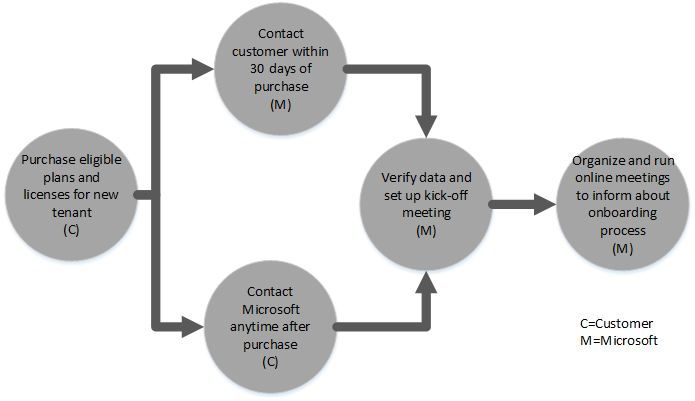
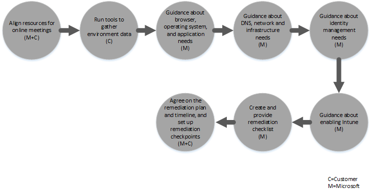
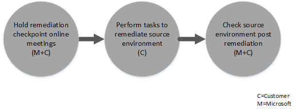
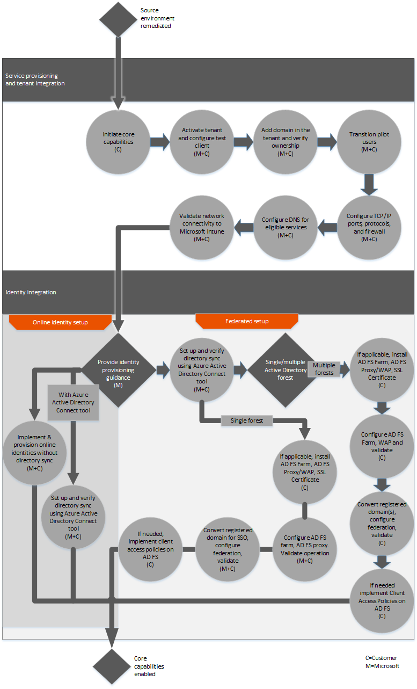
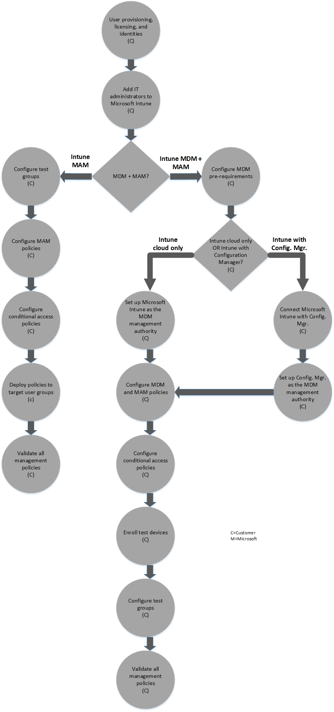

# FastTrack Center Benefit Process for Intune
If your organization is eligible for the Microsoft Intune service benefit, you can work remotely with Microsoft specialists to get your Microsoft Intune environment ready for use.

Microsoft Intune is the part of Microsoft’s Enterprise Mobility Suite (EMS), which provides the Enterprise Mobility Management (EMM) capabilities, including Mobile Device Management (MDM) and Mobile Application Management (MAM).  You can use Microsoft Intune to enable your employees to be productive on mobile devices by provisioning devices, configuring devices, and deploying mobile apps.  You can additionally use Microsoft Intune to help protect your corporate data by monitoring device compliance, protecting mobile applications and data, and integrating with Azure AD to control access to corporate services.

To learn whether your organization is eligible, see [FastTrack Center Benefit for Intune](../Topic/FastTrack_Center_Benefit_for_Intune.md). If you are interested in getting your environment ready for other Enterprise Mobility Suite services, see [FastTrack Center Benefit for Enterprise Mobility Suite](../Topic/FastTrack_Center_Benefit_for_Enterprise_Mobility_Suite.md).

**Are you looking for information about Microsoft FastTrack for Office 365? See**[FastTrack Center Benefit for Office 365](https://technet.microsoft.com/library/office-365-onboarding-benefit.aspx).

This article provides the following information about the service benefit for Microsoft Intune:

- [Overview of the onboarding process](#overview_onboarding_process)

- [Expectations for your source environment](#expectations_src_environ)

- [Phases of the onboarding process](#phases_onboarding_process)

- [Microsoft responsibilities](#microsoft_responsibilities) for each phase

- [Your responsibilities](#your_responsibilities) for each phase

Here’s what you can expect when onboarding is complete:

- Your Microsoft Online Service tenant is created.

- Licensed users can access the Microsoft Intune service by using one of the following identity options:

   - Cloud Identities (unique Microsoft online service accounts).

   - Synchronized Identities: Microsoft Intune accounts synchronized from your on-premises Active Directory with Azure Active Directory Connect (Synchronization services):

      - For customers with a single Active Directory forest environment.

      - For customers with supported multi-forests Active Directory topology.

- Federated Identities--Microsoft Intune accounts:

   - Synchronized from Active Directory with the Microsoft Azure Active Directory Connect tool for customers with a single Active Directory forest configuration or for customers with a single Active Directory account forest (also known as a “logon forest”) and a single Active Directory resource forest configuration.

   - Federated with Windows Server 2012 R2 Active Directory Federation Services role from your on-premises Active Directory or federated with an Active Directory Federation Services (AD FS) 2.0 or later from your on-premises Active Directory.

## Overview of the onboarding process
Onboarding has two major components:

- **Core capabilities** - tasks required for tenant configuration and integration with Azure AD, if needed. The core capabilities component also provides the baseline for onboarding other eligible services.

- **Service onboarding** - tasks required to configure Microsoft Intune.

The following diagram describes the sequence of events for using the FastTrack Center Benefit.

The basic process is as follows:

- The FastTrack Center will attempt to contact you within 30 days from the date you purchase an eligible plan. You can also request assistance from the [FastTrack Center](http://fasttrack.microsoft.com/) if you are ready to deploy these services for your organization. To request assistance, sign in to the [FastTrack Center](http://fasttrack.microsoft.com/), go to the dashboard, select your company name, click the Offers tab, and click the Request Assistance button to request assistance for Microsoft Intune, Azure Active Directory Premium, or Azure Rights Management Premium.

- The FastTrack Center will help you with core capabilities, and then will help you onboard once for each eligible service.

All onboarding support will be provided remotely by assigned Microsoft personnel:

- Microsoft will remotely assist you with various onboarding activities by using a combination of tools, documentation, and guidance.

- Onboarding support is provided by the FastTrack Center, and is available during normal business hours for a given region.

- Onboarding support is available in Traditional Chinese, English, French, German, Italian, Japanese, Portuguese (Brazil), or Spanish.

- The Microsoft team can work directly with you or your representative.

## Expectations for your source environment
You may already have services in your source environment that you want to move to, or integrate with, your Microsoft Intune service. For some services, the FastTrack Center Benefit for Intune includes helping you set up some level of integration with your source environment. If integration is required, then your source environment must be at a minimum level for that application.

The following table shows what is expected in your existing source environment for onboarding.

|Activity    |Source environment expectation    |
|------------|----------------------------------|
|Core capabilities    |Active Directory forests with the functional forest level set to Windows Server 2008 or above, with the following forest configuration:    <ul><li>Single Active Directory forest </li><li>Multiple Active Directory forests </li> </ul> **Note:** For all multiple forests configurations, AD FS deployment is out of scope for the FastTrack Center Benefit.  |
|Service onboarding    <ul><li>Microsoft Intune </li><li>Microsoft Intune integrated with System Center Configuration Manager </li> </ul>|For device management with System Center Configuration Manager 2012 R2 or later version connected with Microsoft Intune, IT administrators will need to follow the [Administrator Checklist: Configuring Configuration Manager to Manage Mobile Devices by Using Microsoft Intune](https://technet.microsoft.com/library/jj943763.aspx). **Note:** The service benefit does not include assistance for setting up or upgrading System Center Configuration Manager to the minimum requirements needed for Microsoft Intune integrated with System Center Configuration Manager.  |

## Phases of the onboarding process
Onboarding has four primary phases:

- Initiate

- Assess

- Remediate

- Enable

For detailed tasks for each phase, see the [Microsoft responsibilities](#microsoft_responsibilities) and  [Your responsibilities](#your_responsibilities) sections.

### Initiate phase
After you have purchased the appropriate number and types of licenses, follow the guidance from the purchase confirmation email to associate the licenses to your existing tenant or new tenant. The FastTrack  Center will verify your eligibility for the service benefit. Microsoft will attempt to contact you within 30 days from the date you purchase an eligible plan. You can also request assistance from the [FastTrack Center](http://fasttrack.microsoft.com/) if you are ready to deploy these services for your organization. To request assistance, sign in to the [FastTrack Center](http://fasttrack.microsoft.com/), go to the dashboard, select your company name, click the Offers tab, and click the Request Assistance button to request assistance for Microsoft Intune, Azure Active Directory Premium, or Azure Rights Management Premium.

During this phase, we’ll discuss the onboarding process, verify data, and set up a kick-off meeting.

### Assess phase
Once the onboarding process begins, Microsoft will work with you to assess your source environment and the requirements. Tools will be run to assess your environment, and Microsoft will guide you through assessing your Internet browsers, client operating systems, DNS, network, infrastructure, and identity system to determine if any changes are required for onboarding. Based on your current setup, we’ll provide a remediation plan that will bring your source environment up to the minimum requirements for successful onboarding to Microsoft Intune. We’ll also set up appropriate checkpoint calls for the remediation phase.

### Remediate phase
If needed, you’ll do the tasks in the remediation plan on your source environment so that you meet the requirements for onboarding each service.

Before beginning the Enable phase, we’ll jointly verify the outcomes of the remediation activities to make sure you’re ready to proceed.

### Enable phase
When all remediation activities are complete, the project shifts to configuring the core infrastructure for service consumption and to provisioning Microsoft Intune.

**Enable phase - Core capabilities**

Enabling core capabilities involves service provisioning and tenant and identity integration. It also includes steps for providing a foundation for onboarding Microsoft Intune.

Onboarding for Microsoft Intune can begin when enabling core capabilities is finished.

**Enable phase – Microsoft Intune**

For Microsoft Intune, and based on your mobile device and mobile applications management needs, we’ll guide you through getting ready to use Microsoft Intune to manage devices. The exact steps depend on your source environment, and may include:

- Licensing your end users. When needed, we’ll also provide assistance on how to activate volume licenses for your Microsoft cloud service tenant.

- Configuring identities to be used by Microsoft Intune, by leveraging either your on-premise Active Directory or cloud identities.

- Adding users to your Microsoft Intune subscription, defining IT Admin roles and creating user and device groups.

- Based on your management needs, configuring your Mobile Device Management authority:

   - Set Microsoft Intune as your MDM authority when Microsoft Intune is your only MDM solution or is in conjunction with Mobile Device Management for Office 365.

   - If you have an existing implementation of System Center Configuration Manager and you are looking to expand its management capabilities with Microsoft Intune, set Configuration Manager as your MDM authority.

      > [!NOTE]
      > If you are only looking to leverage Mobile Application Management over your end-users' owned devices, shared devices, or kiosk-type devices, setting up an MDM authority is not required.

- If Mobile Device Management is in your scope, we’ll provide guidance with:

   - Configuring tests groups to be used to validate MDM management policies.

   - Configuring MDM management policies and services such as:

      - Application deployment for each supported platform through web links or deep links.

      - Conditional access policies.

      - Deployment of email profiles.

      - Setting up the Microsoft Intune Exchange Connector, when applicable.

   - Enrolling up to two test devices of each [supported platform](https://technet.microsoft.com/library/dn600287.aspx) to your Microsoft Intune or Configuration Manager with Microsoft Intune service.

   - Using software and hardware inventory reports.

- If Mobile Application Management (MAM) is in your scope, or if you are looking to complement your existing Microsoft or third-party MDM solution with MAM policies, we’ll provide guidance with:

   - Configuring MAM policies for each supported platform.

   - Configuring conditional access policies for managed apps.

   - Targeting the appropriate user groups with the above MAM policies.

   - Using managed-applications usage reports.

- If PC management is in your scope, we’ll provide guidance with:

   - When needed, installing the Intune client software.

   - Using the software and hardware reports available in Intune.

## Microsoft responsibilities
This section describes some of Microsoft's responsibilities during the onboarding process.

### General

- Provide remote support assistance to you for the required configuration activities as listed in the detailed phase descriptions.

- Provide available documentation and software tools, admin consoles, and scripts to help you reduce or eliminate configuration tasks.

### Initiate phase

- Contact you within 30 days of the purchase of eligible licenses for a new tenant.

- Work with you to begin onboarding.

- Define which eligible services you want to onboard.

### Assess phase

- Provide an administrative overview.

- Provide guidance about:

   - DNS, network, and infrastructure needs.

   - Client needs (Internet browser, client operating system, and services' needs).

   - User identity and provisioning.

   - Enabling eligible services that have been purchased and defined to be part of the onboarding.

- Establish the timeline for remediation activities.

- Provide a remediation checklist.

### Remediate phase

- Hold conference calls with you according to the agreed-upon schedule to review the progress of the remediation activities.

- Assist with running tools to identify and remediate issues, and with interpreting the results.

### Enable phase
Provide guidance about:

- Activating your Microsoft online service tenant.

- Configuring TCP/IP protocols and firewall ports.

- Configuring DNS for eligible services.

- Validating connectivity to Microsoft online services.

- For a single-forest environment:

   - Installing a directory synchronization server between your Active Directory Domain Services (AD DS) and the eligible Microsoft online service(s), if required.

   - Configuring password synchronization (password hash) to Microsoft Intune (Azure Active Directory) with the Azure Active Directory Connect tool.

      > [!NOTE]
      > Development and implementation for custom rules extensions are out of scope.

- For a single forest when the target is federated identities: Installing and configuring Active Directory Federation Services (AD FS) for local domain authentication with Microsoft Intune in a single-site, fault-tolerant configuration, if required.

   > [!NOTE]
   > For all multiple forest configurations, AD FS deployments are out of scope.

- Testing single sign-on (SSO) functionality if deployed.

#### Enable phase - Microsoft Intune
Provide guidance with:

- Licensing your end users. When needed, we’ll also provide assistance on how to activate volume licenses for your Microsoft cloud service tenant.

- Configuring identities to be used by Microsoft Intune, by either leveraging your on-premise Active Directory or cloud identities.

- Adding users to your Microsoft Intune subscription, defining IT Admin roles, and creating user and device groups.

- Based on your management needs, configuring your Mobile Device Management authority:

   - Set Microsoft Intune as your MDM authority when Microsoft Intune is your only MDM solution or is in conjunction with Mobile Device Management for Office 365.

   - If you have an existing implementation of System Center Configuration Manager and you are looking to expand its management capabilities with Microsoft Intune, set Configuration Manager as your MDM authority.

      > [!NOTE]
      > If you are only looking to leverage Mobile Application Management over your end-users' owned devices, shared, or kiosk-type devices, setting up an MDM authority is not required.

- If Mobile Device Management is in your scope, we’ll provide guidance with:

   - Configuring tests groups to be used to validate MDM management policies.

   - Configuring MDM management policies and services such as:

      - Application deployment for each supported platform through web links or deep links.

      - Conditional access policies.

      - Deployment of e-mail profiles.

      - Setting up the Microsoft Intune Exchange Connector, when applicable.

   - Enrolling up to two test devices of each supported platform to your Microsoft Intune or Configuration Manager with Microsoft Intune service.

   - Using hardware and software inventory reports.

- If Mobile Application Management (MAM) is in your scope, or if you are looking to complement your existing third-party MDM solution with MAM policies, we’ll provide guidance with:

   - Configuring MAM policies for each supported platform.

   - Configuring conditional access policies for managed apps.

   - Targeting the appropriate user groups with the above MAM policies.

   - Using managed-applications usage reports.

- If PC management is in your scope, we’ll provide guidance with:

   - When needed, installing the Intune client software.

   - Using the software and hardware reports available in Intune.

## Your responsibilities
This section describes some of your responsibilities during the onboarding process.

### General

- Any enhancements and integrations to your Microsoft Online service tenant beyond the configurable options listed in this article.

- Overall program and project management of your resources.

- End-user communications, documentation, training, and change management.

- Helpdesk documentation and training.

- Producing any reports, presentations, or meeting minutes that are specific to your organization.

- Creating architectural and technical documentation specific to your organization.

- Designing, procuring, installing, and configuring hardware and networking.

- Procuring, installing, and configuring software.

- Configuring, packaging, and distributing client software required for Microsoft Intune.

- Activating mobile devices.

- Network configuration, analysis, bandwidth validation, testing, and monitoring.

- Managing a technical change management approval process and creating supporting documentation.

- Specifying and defining group policies for user, workstation, and server management.

- Modifying your operational model and operation guides.

- Setting up multifactor authentication.

- Decommissioning and removing source environments (like other PC or device management solutions).

- Constructing and maintaining your test environment.

- Installing service packs and other required updates on infrastructure servers.

- Providing and configuring any public SSL certificates.

- Writing the organization’s Terms of Use (TOU) statement to be configured and displayed on the Microsoft Intune company portals accessible to end users.

### Initiate phase

- Work with the Microsoft team to begin onboarding of eligible services.

- Participate in the engagement kick-off meeting, manage and lead participants from your organization, and confirm remediation timelines.

### Assess phase

- Identify appropriate stakeholders (including a project manager) to complete the necessary assessment activities.

- If you choose to, share your screen with Microsoft if guidance is needed when running evaluation tools against your environment or your Microsoft Intune subscription.

- Participate in the meetings to create the remediation checklist and to contribute to the overall plan, including infrastructure, network, administration, directory synchronization preparation, network security, and federated identity topics.

- Participate in the meetings to outline the user-provisioning approach.

- Participate in the meetings to plan online service configuration.

- Create a support plan for migration readiness.

### Remediate phase

- Perform required steps to complete remediation activities identified in the Assess phase.

- Participate in checkpoint meetings.

### Enable phase

- If you choose to, share your screen with Microsoft if guidance is needed when running changes to your environment or your Microsoft online service subscription.

- Manage resources as appropriate.

- Configure network-related items per guidance from Microsoft.

- Perform directory readiness and configure directory synchronization per guidance from Microsoft.

- Configure security-related infrastructure (such as firewall ports) per guidance from Microsoft.

- Implement the appropriate client infrastructure.

- Implement a user-provisioning approach per guidance from Microsoft.

- Enable various services per guidance from Microsoft.

- Work with Microsoft to complete onboarding of all eligible services within 12 months from when the onboarding began.

- When enabling PC or mobile device management with Microsoft Intune, use test devices when enabling management policies through Microsoft Intune. If test devices are not available, customers are responsible for backing up and, if needed, restoring all content from the devices used during the Microsoft Intune enable phase.

- Selecting up to two applications for each Microsoft Intune supported platform that can be deployed through web links or deep links.

- Managing, configuring, and applying security policies beyond those used to test the Microsoft Intune services baseline configuration and functionality.

## Want to learn more?
See [Microsoft Intune](http://www.microsoft.com/en-us/server-cloud/products/microsoft-intune/default.aspx) and [Enterprise Mobility Suite](http://www.microsoft.com/en-us/server-cloud/products/enterprise-mobility-suite/default.aspx).

